# Finance Tracker

A clean, completely offline personal-finance app for Android. Built natively in Kotlin with Room (SQLite), Material 3, MVVM, and Navigation Component. No internet, no ads, no tracking, no subscriptions — my financial data stays on my device.

Built as a personal project with the help of Google Gemini; v2 redesign done with Claude.

---

<p align="center">
  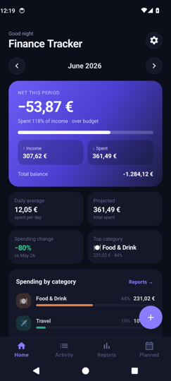&nbsp;
  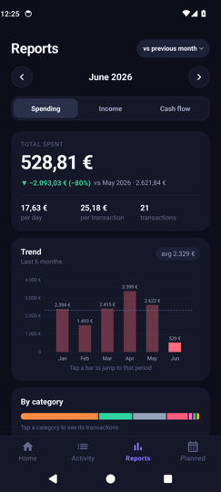&nbsp;
  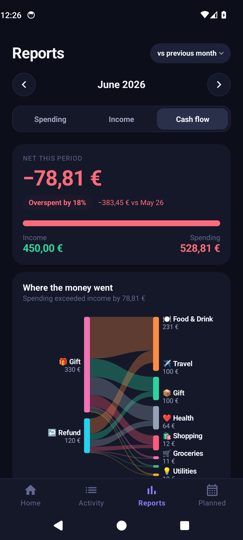&nbsp;
  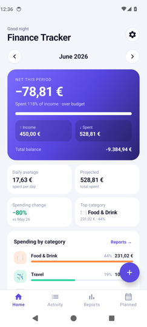
</p>

## Features

- **Home** — greeting, a **month picker** (‹ › arrows), and a hero card with net for the month, income vs. spent with a spend-to-income bar, and your all-time balance. Below it: daily average, projected month-end spend, spending change vs. last month, top category, the top spending categories with bars, **upcoming planned payments** (next 30 days), **detected recurring payments**, and recent transactions.
- **Add / edit transaction** — Expense/Income toggle, a big amount field, category chips, quick date chips (Today / Yesterday / Pick…), an optional note, and delete when editing.
- **Activity** — full history grouped under day headers ("Today", "Yesterday", "Wed 17 Jun") with a per-day net, **search** by note or category, All / Expenses / Income filters, tap to edit and **swipe left to delete with undo**. CSV import/export live in the ⋮ menu.
- **Reports** — modelled on how Monarch, Copilot and YNAB present money, and built around one question per section:
  - **Period navigation** — ‹ › through months; tap the period label to switch to **quarters or years**. Every number has a comparison against the **previous period or the same period last year** (choose at the top right).
  - **Spending / Income tabs** — total with ▲/▼ change vs. the comparison period, per-day and per-transaction averages; a **trend chart** for the last 6 periods with a dashed average line (tap a bar to jump to that period); a **stacked share bar** plus a category list showing amount, share, transaction count and change vs. the comparison period; **spending pace** (cumulative spend by day vs. the previous month, Copilot-style); **spending by day of week**; **top places & notes**; and the **largest transactions**.
  - **Tap any category** to drill down: share, count, average, change, a 6-period history chart, and every transaction in that category for the period (tap to edit).
  - **Cash flow tab** — net with savings rate (or overspend), income vs. spending bar, a **Sankey diagram** showing how income sources flow into spending categories and what was saved, income vs. spending for the last 12 months, and your cumulative **balance over time**.
- **Planned** — plan a future payment and **tick it off when paid**; that logs a real transaction dated today. Upcoming and done sections, relative due dates ("Tomorrow", "In 5 days", "Overdue"), swipe to delete with undo.
- **Reminders** — a notification on the morning of a planned payment's date (survives reboots).
- **Settings** — manage categories (emoji, name and a **colour palette**), export/import CSV, and app info.
- **Light & dark themes** — follows the system setting. Indigo accent, emerald income, coral spending; "Paper" light palette and "Midnight" dark palette.
- **Motion** — fade-through screen transitions, a sliding tab indicator, amounts that count up, bars and the Sankey that sweep in, staggered rows and list entrances. Everything respects the system animation-scale setting.
- **Offline-first** — everything is stored locally in `finance_tracker.db`; no internet permission, no ads, no tracking.

---

## Tech stack

| Area | Choice |
|---|---|
| Language | Kotlin 1.9.22 (java.time for periods) |
| Min / Target SDK | 26 / 34 |
| Architecture | MVVM (ViewModel + LiveData + Repository) |
| UI | View system, Material Components 1.11, ConstraintLayout, ViewBinding |
| Navigation | AndroidX Navigation Component (single Activity, multiple Fragments) |
| Persistence | Room 2.6.1 (SQLite) with KSP |
| Async | Kotlin Coroutines |
| Charts | [MPAndroidChart v3.1.0](https://github.com/PhilJay/MPAndroidChart) + custom Sankey / bar views |
| Build | Gradle Kotlin DSL, AGP 8.2.2 |
| Tests | JUnit 4 unit tests for the domain layer (`./gradlew testDebugUnitTest`) |

---

## How to use the app

The app has four tabs along the bottom: **Home**, **Activity**, **Reports** and **Planned**. The **+** button on Home and Activity adds a transaction; the gear on Home opens Settings. Everything below shows the dark theme unless noted; the app follows your phone's light/dark setting automatically.

### 1. Home — the month at a glance

| | |
|:--:|:--:|
|  | 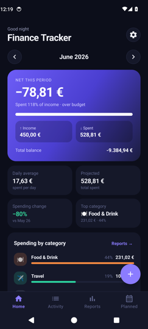 |
| Month picker, net for the month and total balance | Scroll for top categories, upcoming and recurring |

- Use **‹ ›** to move between months. The hero card shows the month's **net** (income minus spending), a bar of how much of your income you have spent, income and spent totals, and your **all-time balance** at the bottom.
- The four tiles show the **daily average**, the **projected** month-end spend at the current pace, the **spending change** vs. last month, and the **top category**.
- **Spending by category** lists your biggest categories with bars; tap **Reports →** for the full breakdown.
- **Upcoming** shows planned payments due in the next 30 days. **Recurring & subscriptions** appears when the app detects the same payment in three or more months.
- **Recent** shows the last five transactions; tap one to edit it.

### 2. Adding a transaction

| | |
|:--:|:--:|
| 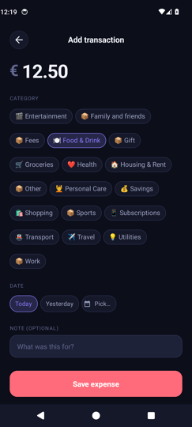 | |
| Add or edit a transaction | |

1. Tap **+** on Home or Activity.
2. Choose **Expense** or **Income** at the top.
3. Type the **amount**.
4. Tap a **category** chip. (Categories are managed in Settings, see below.)
5. Pick the **date**: *Today*, *Yesterday*, or *Pick…* for a calendar.
6. Optionally write a **note** (for example "dinner" or "Lisbon flight"). Notes are searchable and power the "Top places & notes" report.
7. Tap **Save expense** / **Save income**.

Tapping any transaction anywhere in the app opens the same screen to **edit** it; a trash icon at the top right deletes it.

### 3. Activity — your full history

| | |
|:--:|:--:|
| 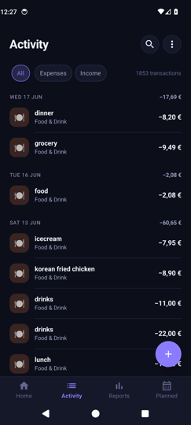 | 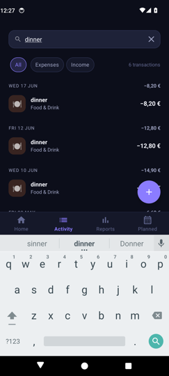 |
| Grouped by day with a per-day net | Search by note or category |

- Transactions are grouped under **day headers** ("Today", "Yesterday", "Wed 17 Jun") with the day's net total on the right.
- Use the **All / Expenses / Income** chips to filter, and the **magnifier** to search notes and category names.
- **Swipe a row to the left** to delete it. An **Undo** bar appears for a few seconds.
- The **⋮** menu holds **Export CSV** and **Import CSV** (see "Data" below).

### 4. Reports — where the money goes

Reports are built around a period and a comparison. Pick the **period** with ‹ ›; tap the period label to switch between **Month, Quarter and Year**. Use the pill at the top right to compare against the **previous period** or the **same period last year**. Every number and chart in the tab uses that choice.

| | |
|:--:|:--:|
| 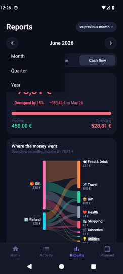 | 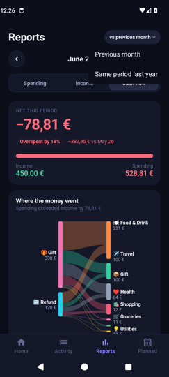 |
| Tap the period label to switch month / quarter / year | Choose what to compare against |

#### Spending and Income tabs

| | | |
|:--:|:--:|:--:|
|  | 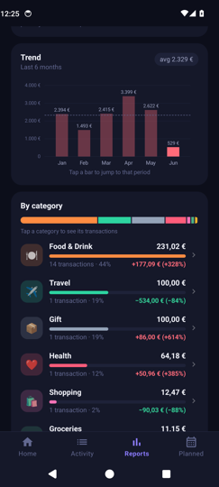 | 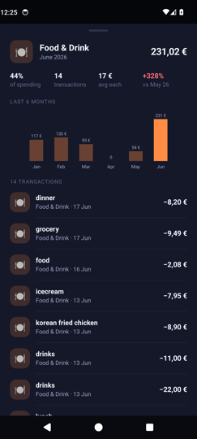 |
| Total, change and averages, then the trend | By category with change per category | Tap a category to drill in |

- The **top card** shows the total for the period, the ▲/▼ change against the comparison period, and per-day / per-transaction averages.
- **Trend** shows the last six periods with a dashed line at your average. **Tap a bar to jump to that period.**
- **By category** shows a stacked share bar and one row per category with amount, transaction count, share, and change vs. the comparison period.
- **Tap a category** to open its detail sheet: share of spending, count, average, change, a six-period history, and every transaction in that category (tap one to edit).

| | | |
|:--:|:--:|:--:|
| 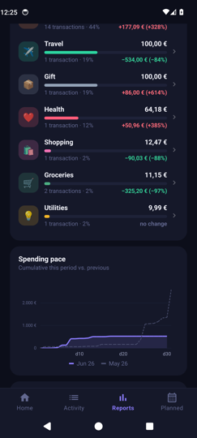 | 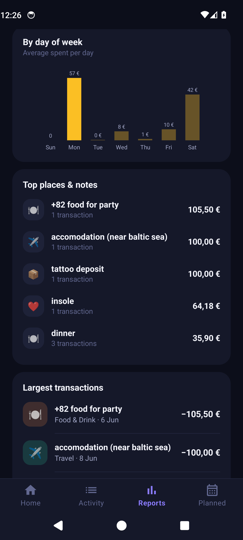 | 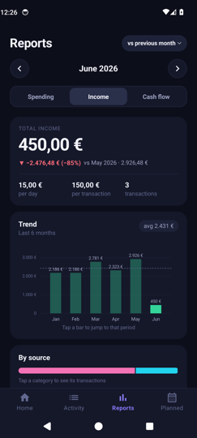 |
| Spending pace vs. the previous month | Day of week, top notes, largest transactions | The Income tab works the same way |

- **Spending pace** plots how spending accumulated day by day this period (solid) against the comparison period (dashed), so you can see early in the month whether you are ahead or behind.
- **By day of week** shows your average spend on each weekday.
- **Top places & notes** groups transactions by note, and **Largest transactions** lists the biggest single items.

#### Cash flow tab

| | |
|:--:|:--:|
|  | 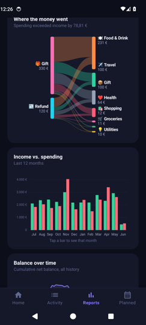 |
| Net, savings rate and where the money went | Income vs. spending and balance over time |

- The **top card** shows the net for the period, your **savings rate** (or how much you overspent), and an income-to-spending bar.
- **Where the money went** is a Sankey diagram: income sources on the left flow into spending categories on the right, with a **Saved** node when you spent less than you earned.
- **Income vs. spending** compares the two for the last 12 months (tap a bar for the numbers), and **Balance over time** shows your cumulative balance across your whole history.

### 5. Planned — future payments and reminders

| | |
|:--:|:--:|
| 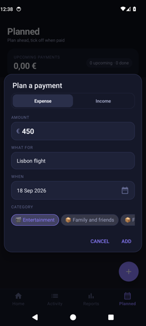 | 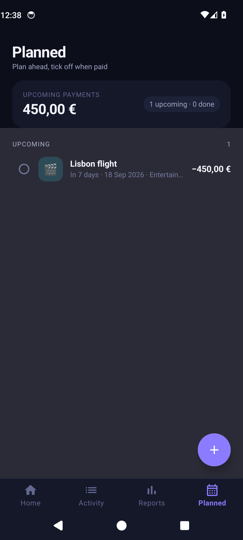 |
| Plan a payment | Upcoming payments, tick off when paid |

1. Tap **+** and fill in the amount, what it is for, the date and a category.
2. The payment appears under **Upcoming** with a relative due date ("Tomorrow", "In 7 days", "Overdue"), and on Home under Upcoming when it is within 30 days.
3. On the morning of the due date you get a **notification** (allow notifications when asked; reminders survive a reboot).
4. When you actually pay, **tap the circle** to tick it off. The app logs a real transaction dated today, so it flows into Activity and Reports. Un-tick to remove that transaction again.
5. Swipe a row left to delete it (with undo).

### 6. Settings — categories and data

| | | |
|:--:|:--:|:--:|
| 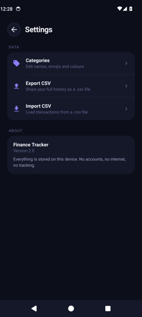 | 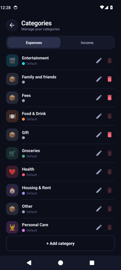 | 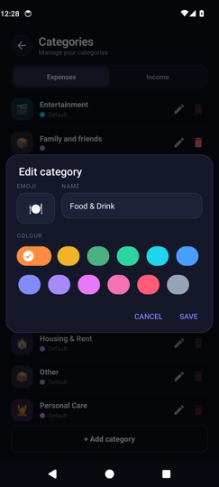 |
| Settings | Manage categories | Emoji, name and colour |

- **Categories**: switch between Expenses and Income, tap a row (or the pencil) to change its emoji, name or colour, and use **+ Add category** for your own. Default categories can be edited but not deleted; custom ones can be deleted and existing transactions keep their label.
- **Export CSV** shares your full history as a `.csv` file (Date, Type, Amount, Category, Note) through the system share sheet.
- **Import CSV** loads transactions from a `.csv` in the same format; unknown categories are created automatically and a summary tells you how many rows were imported or skipped.

### Light mode

| | | |
|:--:|:--:|:--:|
|  | 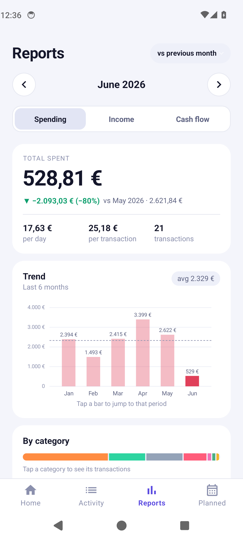 | 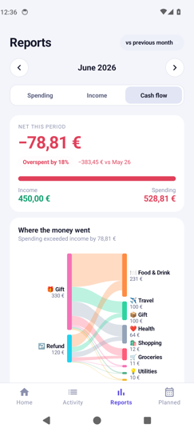 |

The app follows the system theme: "Paper" in light mode and "Midnight" in dark mode.

---

## Building and running

```bash
./gradlew :app:assembleDebug        # builds app/build/outputs/apk/debug/app-debug.apk
./gradlew :app:testDebugUnitTest    # runs the domain unit tests
```

Or open the folder in Android Studio and press Run. Requires JDK 17+ (Android Studio's bundled JDK works) and Android SDK 34.

---

## Project structure

```
app/src/main/
├── java/com/personal/financetracker/
│   ├── data/
│   │   ├── Transaction.kt          Room @Entity
│   │   ├── Category.kt             Room @Entity + default seed lists
│   │   ├── PlannedPayment.kt       Room @Entity for future payments
│   │   ├── *Dao.kt                 Room DAOs
│   │   ├── AppDatabase.kt          Room DB (v2), seeds defaults synchronously, v1→v2 migration
│   │   ├── Repository.kt           Single source of truth for the app
│   │   └── CsvTransfer.kt          CSV export/import parsing
│   ├── domain/
│   │   ├── Period.kt               Month / quarter / year periods (java.time, DST-safe)
│   │   └── Analytics.kt            Pure calculations: summaries, categories, trends, pace, weekday, Sankey, recurring
│   ├── notify/                     Planned-payment reminders (AlarmManager + boot receiver)
│   ├── ui/
│   │   ├── MainActivity.kt         Bottom nav host; hides nav on full-screen pages
│   │   ├── common/                 PeriodPickerView, SegmentedControl, RatioBarView, StackedBarView, SankeyView, chart styling, Anim helpers
│   │   ├── dashboard/              Home + ViewModel
│   │   ├── transactions/           Activity list, adapters, search + swipe delete
│   │   ├── add/                    Add/edit transaction
│   │   ├── reports/                Reports + ViewModel + CategoryDetailSheet
│   │   ├── planned/                Planned payments
│   │   ├── categories/             Category management
│   │   └── settings/               Settings
│   └── util/Formatters.kt          Currency + date helpers
├── res/
│   ├── layout/                     Screens, report sections, list rows
│   ├── drawable/                   Vector icons + shapes
│   ├── values/                     light colors, dimens, strings, themes (typography + component styles)
│   ├── values-night/               dark colors
│   └── navigation/nav_graph.xml
└── test/                           JUnit tests for Period and Analytics
```


## Customising

**Currency.** Currency formatting lives in `app/src/main/java/com/personal/financetracker/util/Formatters.kt`:

```kotlin
private val currencyFormat = NumberFormat.getCurrencyInstance(Locale.GERMANY)
```

Out of the box this renders amounts as Euros (€). Change the `Locale` to suit your country — for example `Locale.UK` for GBP (£), `Locale.US` for USD ($), or `Locale("en", "IN")` for INR (₹).

**Default categories.** Edit `defaultExpenseCategories` and `defaultIncomeCategories` in `data/Category.kt`. They are seeded when the database is first created, so to re-seed wipe app data or uninstall and reinstall.

**Theme & colours.** The light palette lives in `res/values/colors.xml` and the dark palette in `res/values-night/colors.xml` (same names, so every screen adapts automatically). Typography and component styles are in `res/values/themes.xml`. Animation timings live in `ui/common/Anim.kt`.

---

## Data and privacy

All data is stored locally in a SQLite database file named `finance_tracker.db`, inside the app's private storage on the device. Nothing is sent off-device — the app declares no internet permission.

The only permissions used are `POST_NOTIFICATIONS` (to show planned-payment reminders) and `RECEIVE_BOOT_COMPLETED` (to restore reminders after a reboot). CSV export/import goes through the system share/file-picker, so you stay in control of where data goes.

Uninstalling the app deletes the database. The app database is at schema **version 2**; upgrading from an older build runs a migration that adds the `planned_payments` table without touching existing data.

---

PRs and ideas welcome.

---

## Credits

- Built by Amyth, with Google Gemini as a coding assistant; v2 redesign with Claude
- Report design informed by how Monarch Money, Copilot Money and YNAB present spending, cash flow and comparisons
- Charts by [MPAndroidChart](https://github.com/PhilJay/MPAndroidChart)
- Icons from Material Symbols

---

## License

MIT — do whatever you like with the code. If you build something cool on top of it, drop a link.
